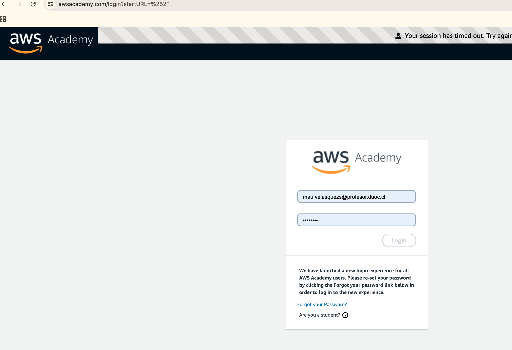
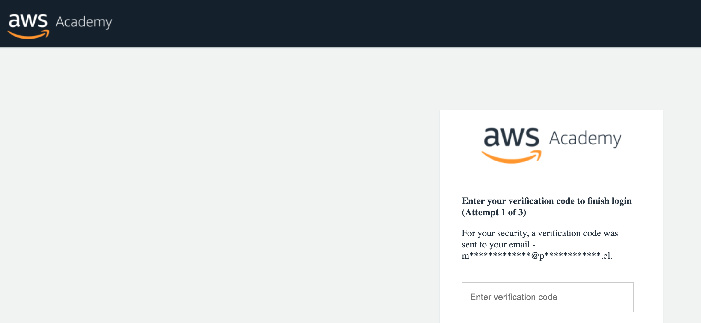
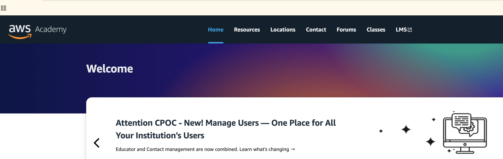
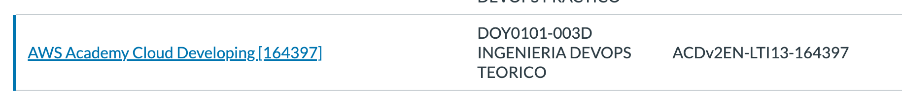
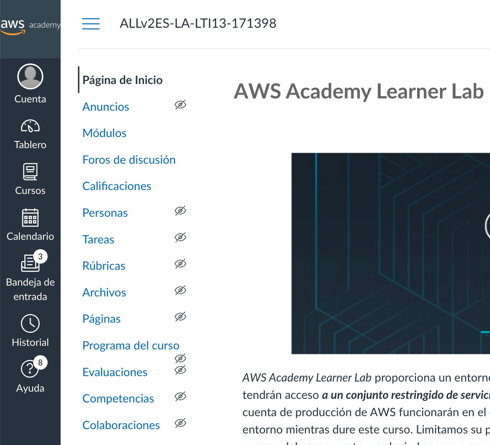
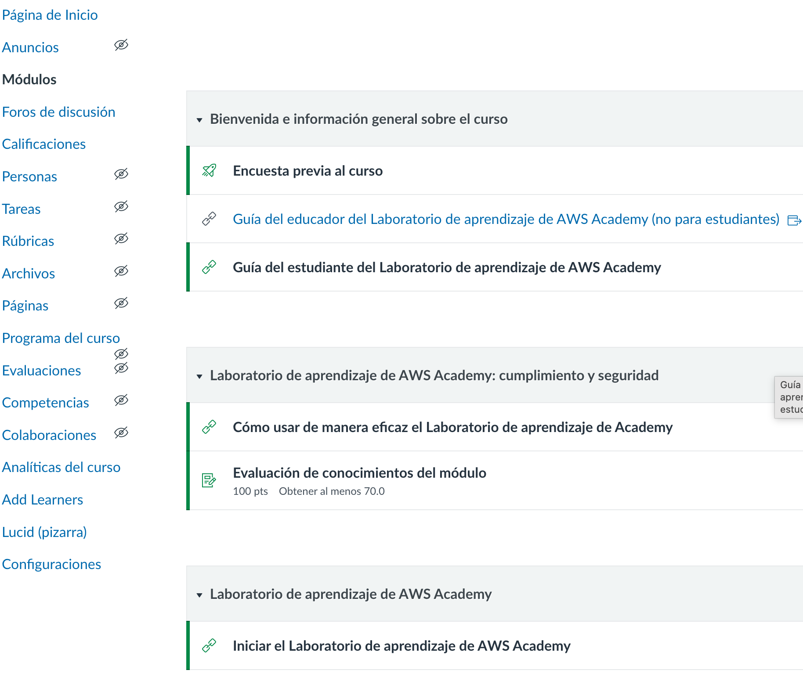
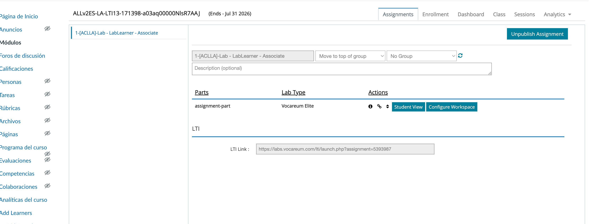
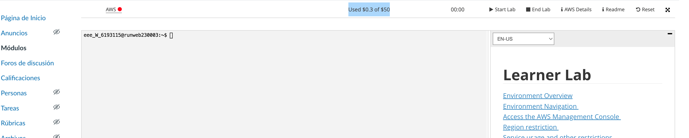
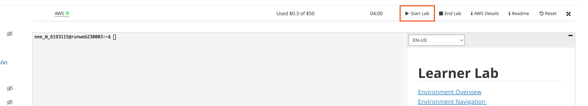
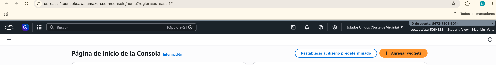

# Ingresar a aws academy

```
https://www.awsacademy.com/login
```




## Verificación




## Seleccionar LMS




## Seleccionar el curso




## Seleccionar modulos del curso




## Iniciar laboratorio




## Hacer click en "Student View"




## Revisar el saldo en US 




## Start Lab




## Ingresar finalmente a AWS (se debe hacer click en el icono verde)


