## Creación de maquina virtual (EC2)

## Buscar EC2

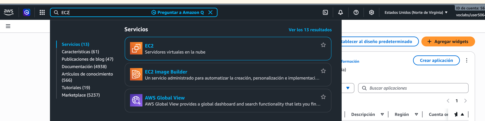

## Ingresar a EC2

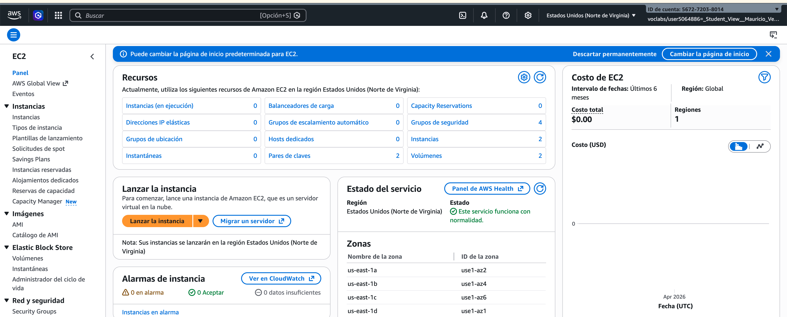

## Lanzar la instancia (crear una EC2)

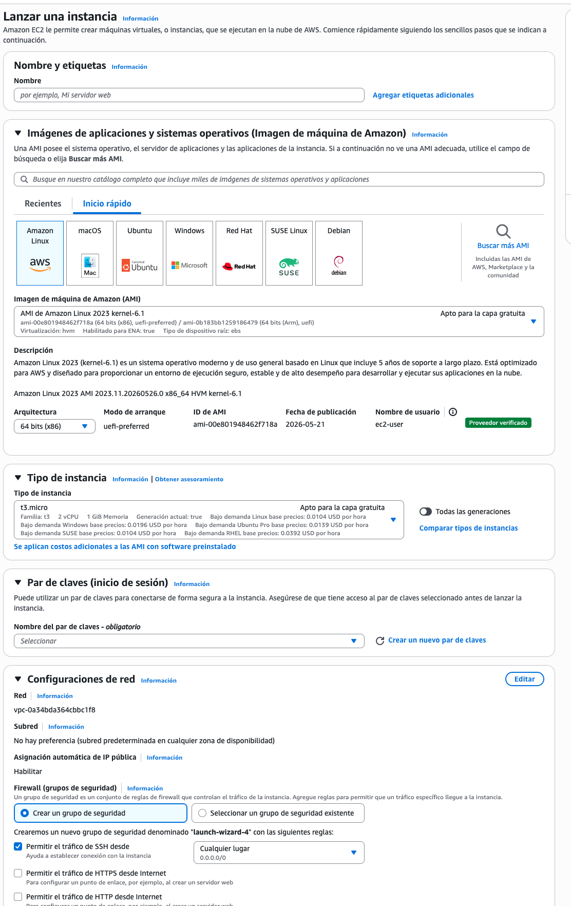

## Poner nombre 

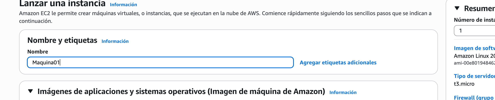

## Seleccionar la imagen

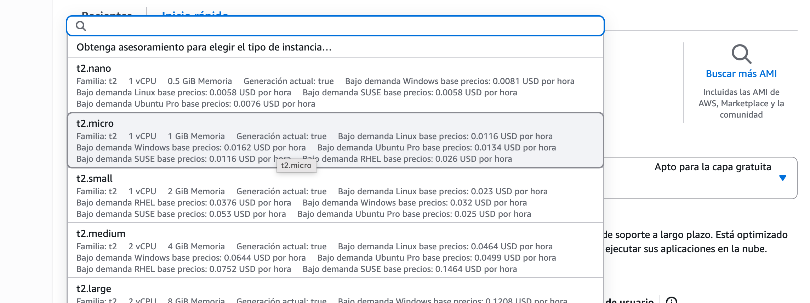

## Crear claves para ingresar 

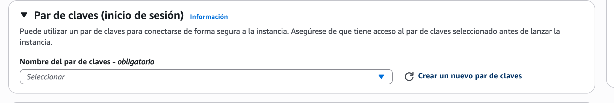

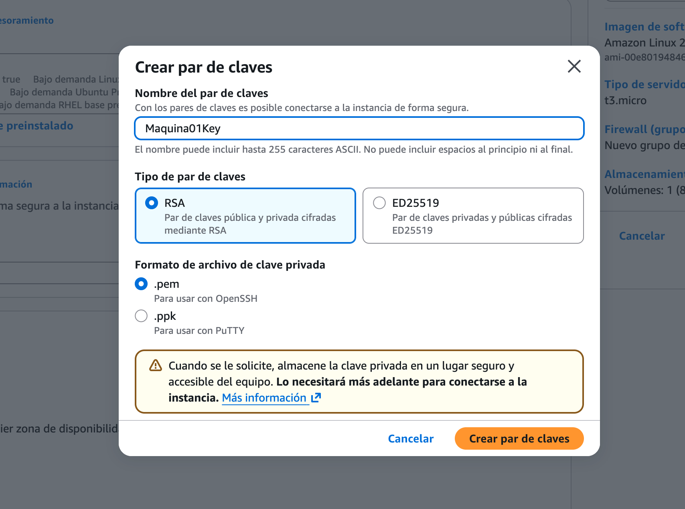

## Detalles avanzados

## Seleccionar perfil de instancia de IAM

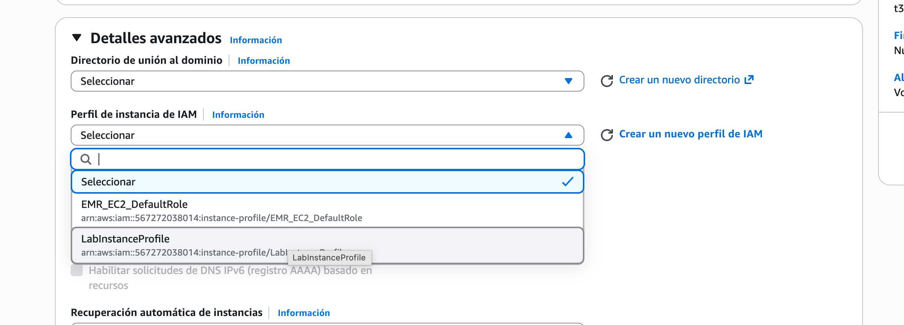

## Lanzar instancia

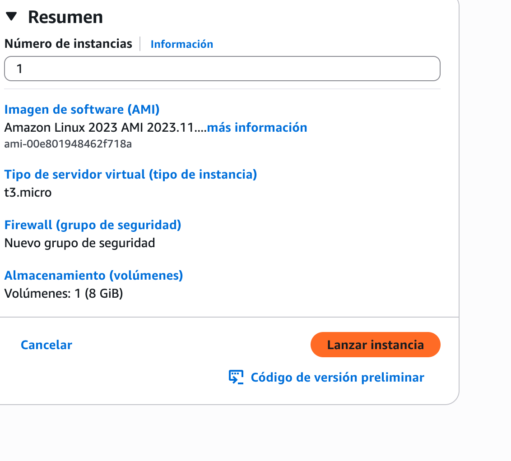

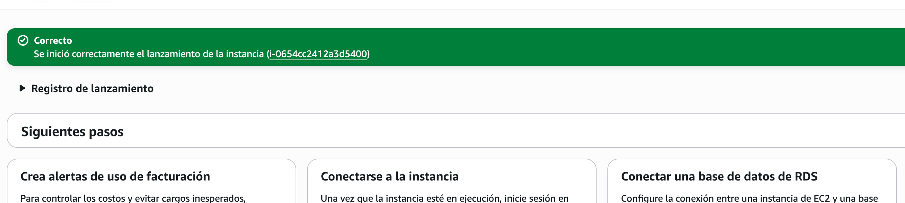

## Ver todas las instancias

## Esperar hasta que ya quede activa

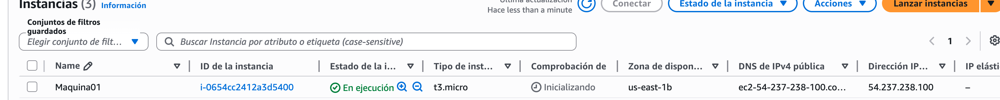

## Ingresar al detalle de la maquina

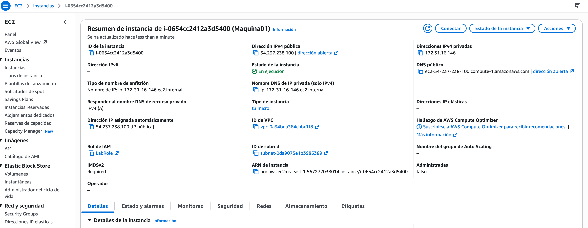

## Conectar para ingresar al servidor

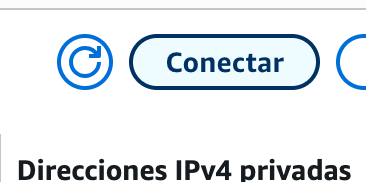

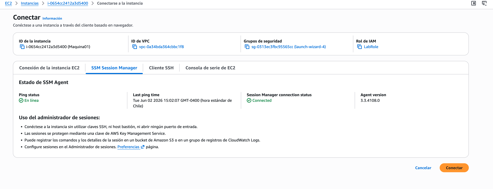

## Ya ingresado 

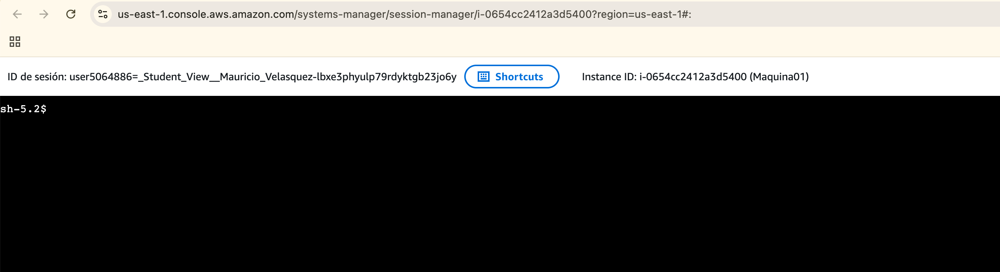
