# Cloudwatch

Vamos a activar un agente en la maquina creada para que entregue información

## EC2 en funcionamiento

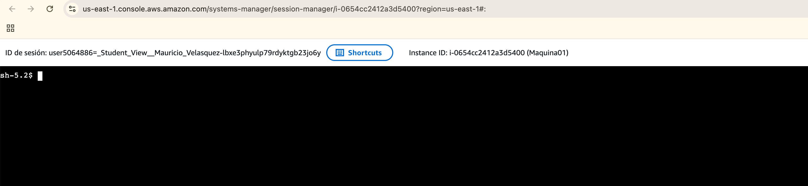

## Obtener token IMDSv2

```
TOKEN=$(curl -X PUT "http://169.254.169.254/latest/api/token" \
-H "X-aws-ec2-metadata-token-ttl-seconds: 21600")
```

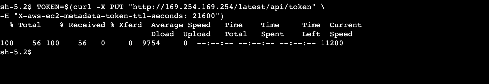

## Verificar el rol IAM asociado

```
curl -H "X-aws-ec2-metadata-token: $TOKEN" \
http://169.254.169.254/latest/meta-data/iam/security-credentials/
```

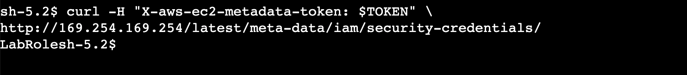

## Instalar CloudWatch Agent

```
sudo dnf install amazon-cloudwatch-agent -y
```

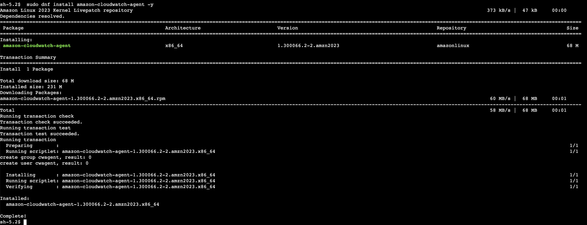

## Crear configuración del agente

```
sudo mkdir -p /opt/aws/amazon-cloudwatch-agent/etc
```

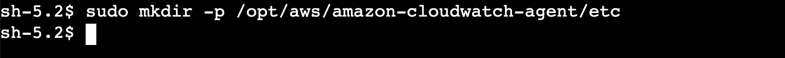


## Hacerse root (administrador)

```
sudo su -
```

## Crear el archivo de configuración

```
cat > /opt/aws/amazon-cloudwatch-agent/etc/amazon-cloudwatch-agent.json << 'EOF'
{
  "metrics": {
    "namespace": "CWAgent",
    "metrics_collected": {
      "cpu": {
        "measurement": [
          "cpu_usage_idle",
          "cpu_usage_user",
          "cpu_usage_system"
        ],
        "totalcpu": true
      },
      "mem": {
        "measurement": [
          "mem_used_percent"
        ]
      },
      "disk": {
        "measurement": [
          "used_percent"
        ],
        "resources": [
          "*"
        ]
      }
    }
  }
}
EOF
```


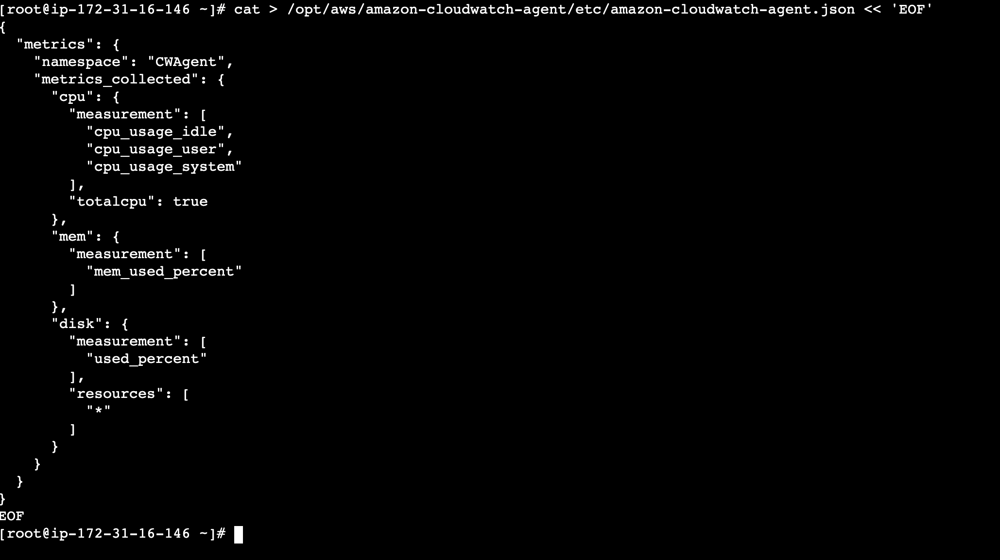


## Iniciar el servicio de agente

```
systemctl start amazon-cloudwatch-agent
```

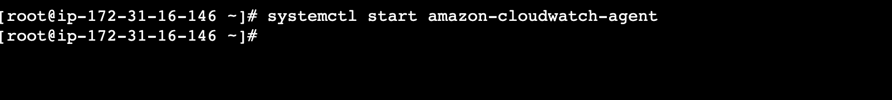


## Verificar el funcionamiento

```
/opt/aws/amazon-cloudwatch-agent/bin/amazon-cloudwatch-agent-ctl -a status
```

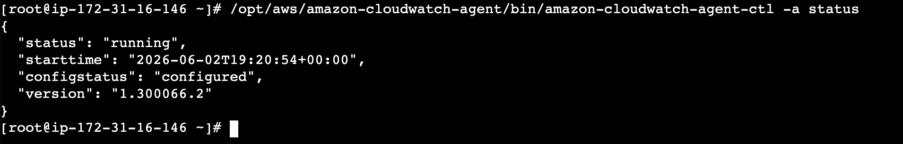


## Ahora vamos a buscar en cloudWatch

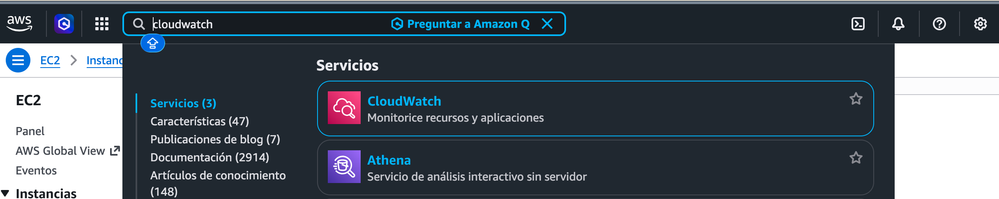


## Todas las metricas


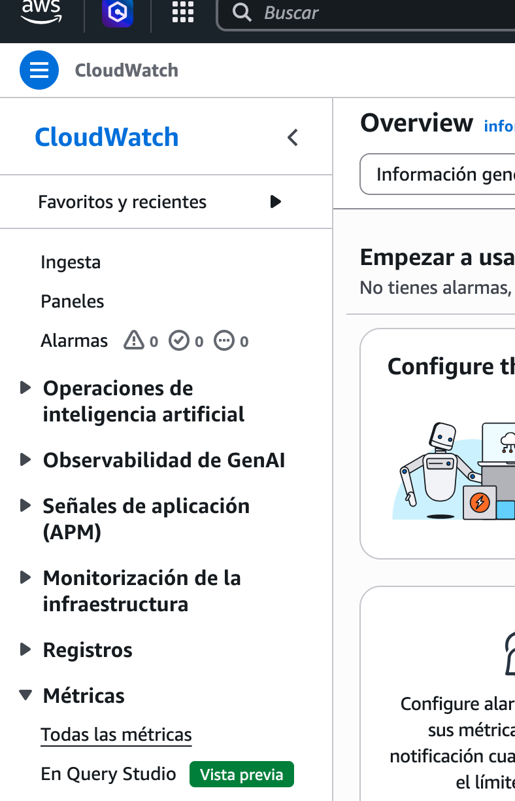


## Acceso a los registros

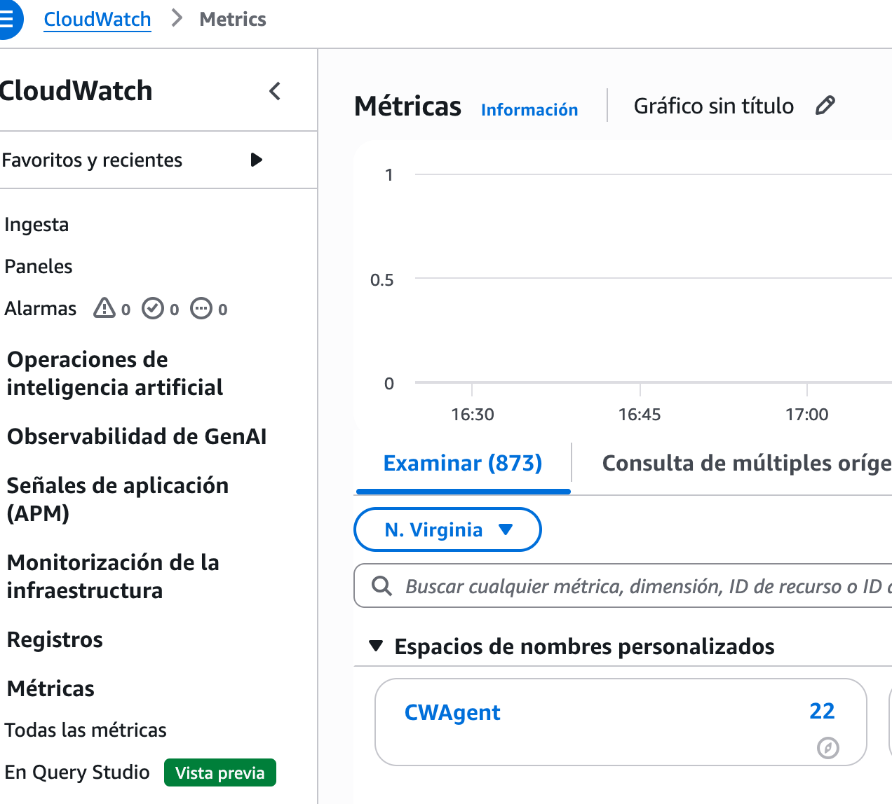
